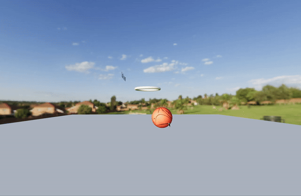

# 3d-basketball

Basic 3D basketball simutation using React-Three-Fibre



## To run

```bash
npm i
npm run start
```

## routes:

- '/' for home
- '/gltfs' for example rendering of gltf models
- '/game' for example interactive 3D basketball simulation
